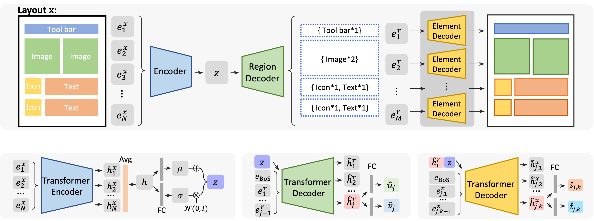

# Coarse-to-Fine
__[AAAI22] Coarse-to-Fine Generative Modeling for Graphic Layouts__

## Introduction
This is the implementation for the paper "Coarse-to-Fine Generative Modeling for Graphic Layouts", by _Zhaoyun Jiang, Shizhao Sun, Jihua Zhu, Jian-Guang Lou, Dongmei Zhang_.

Paper: [AAAI](https://ojs.aaai.org/index.php/AAAI/article/download/19994/19753)
Code: [GitHub](https://github.com/microsoft/LayoutGeneration/tree/main/Coarse-to-Fine)

## Preparation
Please follow __Installation__ and __Dataset__ in [this instruction](https://github.com/microsoft/LayoutGeneration/blob/main/LayoutFormer%2B%2B/README.md) to clone the repository, create environment and prepare the datasets.

Then move `LayoutGeneration/Coarse-to-Fine/coarse2fine` to `LayoutGeneration/LayoutFormer++/src/`.

    cp -r LayoutGeneration/Coarse-to-Fine/coarse2fine LayoutGeneration/LayoutFormer++/src/

## Inference
Download checkpoints from [Huggingface](https://huggingface.co/jzy124/Coarse2Fine/tree/main).

- download checkpoints:

        git lfs install
        git clone https://huggingface.co/jzy124/Coarse2Fine

- move `Coarse2Fine/ckpts` to `LayoutFormer++/`, as

        LayoutGeneration/LayoutFormer++/
        ├── datasets
        ├── ckpts
        ├── src
            ├── coarse2fine
            ├── ...
        ├── README.md
        ├── ...

Then, run

    cd LayoutGeneration/LayoutFormer++/src/
    pip install -e .

For testing on RICO, run

    CUDA_VISIBLE_DEVICES=0 ./coarse2fine/coarse2fine_rico.sh test ../datasets/ ../ckpts/rico/ basic 1

For testing on PubLayNet, run

    CUDA_VISIBLE_DEVICES=0 ./coarse2fine/coarse2fine_pln.sh test ../datasets/ ../ckpts/publaynet/ basic 1

## Training

Take training on RICO dataset as example:

    ./coarse2fine/coarse2fine_rico.sh train ../datasets/ {OUTPUT_DIR} {TRAINER} {GPU_NUMBER}

## Citation
If this work helps your research, please cite:

    @article{Jiang_Sun_Zhu_Lou_Zhang_2022, 
        title   = {Coarse-to-Fine Generative Modeling for Graphic Layouts}, 
        volume  = {36}, 
        url     = {https://ojs.aaai.org/index.php/AAAI/article/view/19994}, 
        DOI     = {10.1609/aaai.v36i1.19994}, 
        number  = {1}, 
        journal = {Proceedings of the AAAI Conference on Artificial Intelligence}, 
        author  = {Jiang, Zhaoyun and Sun, Shizhao and Zhu, Jihua and Lou, Jian-Guang and Zhang, Dongmei}, 
        year    = {2022}, 
        month   = {Jun.}, 
        pages   = {1096-1103} 
    }

