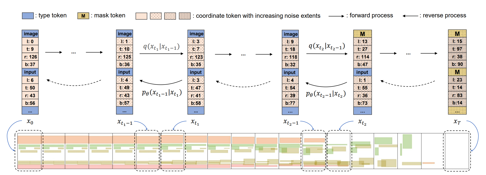
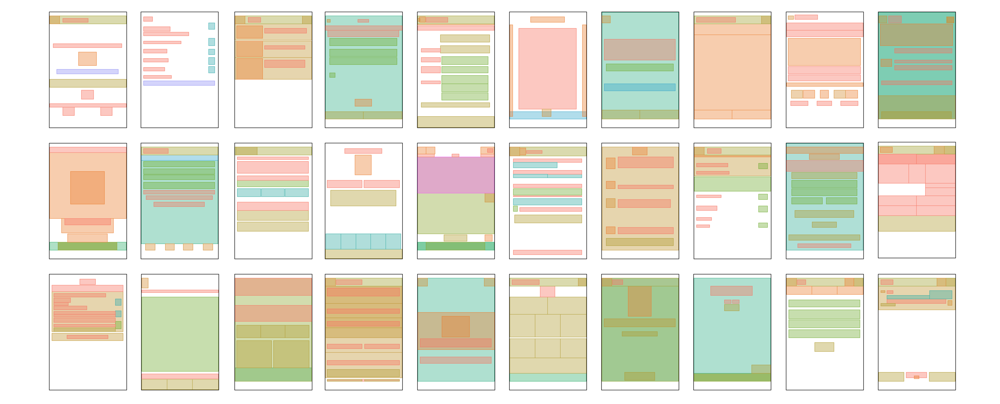
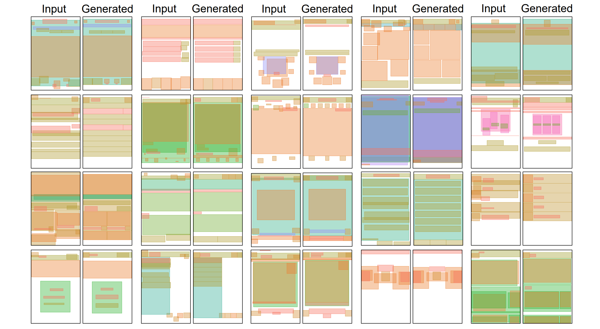
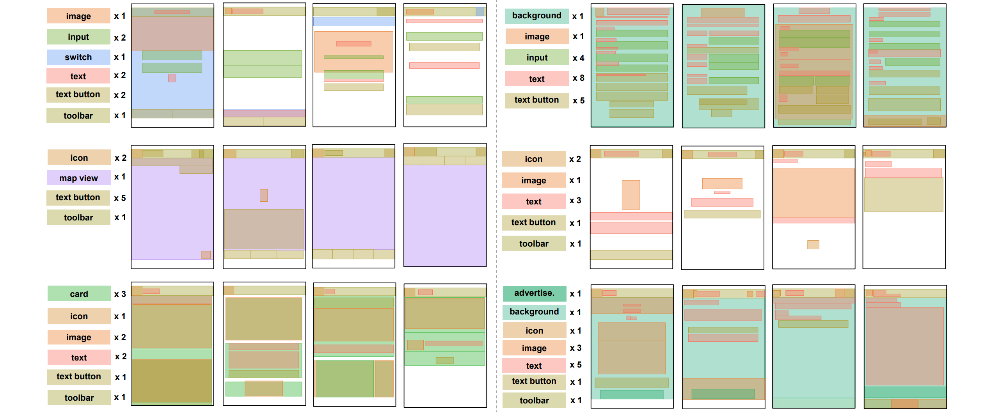

# LayoutDiffusion
**[ICCV23] LayoutDiffusion: Improving Graphic Layout Generation by Discrete Diffusion Probabilistic Models** [[arXiv](https://arxiv.org/abs/2303.11589)], by *Junyi Zhang*, *Jiaqi Guo*, *Shizhao Sun*, *Jian-Guang Lou*, *Dongmei Zhang*, is a generative model that automates graphic layout generation using a discrete denoising diffusion process. It incorporates the critical characteristics of layouts—*legality*, *coordinate proximity*, and *type disruption*—into the diffusion process. This design allows for plug-and-play conditional generation without retraining, leading to impressive performance on RICO and PubLayNet datasets.




## Visual Results

Please refer to the [paper](https://arxiv.org/pdf/2303.11589.pdf) for more results.

### Unconditional Generation


### Refinement


### Generation Conditioned on Type



## Getting Started
### Setting Up the Environment

To get started, create a new conda environment and install the required packages with the following commands:

```bash
  conda create -n laydi python=3.9
  conda activate laydi
  conda install mpi4py
  conda install pytorch=1.12.1 torchvision torchaudio cudatoolkit=11.3 -c pytorch
  pip install -r requirements.txt
  pip install -e improved-diffusion/
  pip install -e transformers/
  pip install -e eval_src/
```

### Preparing the Data and Pretrained Models

You can download the required data and pretrained model from either the [Huggingface Model Hub](https://huggingface.co/Junyi42/layoutdiffusion) or the [Google Drive](https://drive.google.com/drive/folders/1J3JBky7A0IVtgXiO2H3EhGLjeWiHNVUs?usp=sharing). And please put the folder `data` and `results` in the root directory of `LayoutDiffusion`.

Data:
- The RICO dataset has been processed and included in this repository. You need to download the PublayNet dataset from the provided links.
- (Optional) If you want to process new sequence data with raw datasets, use the following scripts:
    - util_scripts/layout2seq_new_rico.ipynb
    - util_scripts/layout2seq_new_publay.ipynb

Pretrained model:
- The pretrained model can be downloaded from the provided links and should be put in the folder `results/checkpoint/`.

### Training
Before training, change to the `improved-diffusion` directory:

```bash
cd improved-diffusion
```

Training on RICO dataset:

```bash
CUDA_VISIBLE_DEVICES=0,1  mpiexec -n 2 python scripts/train.py --checkpoint_path ../results/checkpoint/rico --model_arch transformer --modality e2e-tgt --save_interval 50000 --lr 4e-5 --batch_size 64  --diffusion_steps 200 --noise_schedule gaussian_refine_pow2.5  --use_kl False --learn_sigma False  --aux_loss True --rescale_timesteps False --seq_length 121 --num_channels 128 --seed 102 --dropout 0.1 --padding_mode pad --experiment random  --lr_anneal_steps 175000 --weight_decay 0.0 --predict_xstart True --training_mode discrete1 --vocab_size 159 --submit False --e2e_train ../data/processed_datasets/RICO_ltrb_lex --alignment_loss False
```

Training on PublayNet dataset:

```bash
CUDA_VISIBLE_DEVICES=0,1,2,3  mpiexec -n 4 python scripts/train.py --checkpoint_path ../results/checkpoint/pub_cond --model_arch transformer --modality e2e-tgt --save_interval 50000 --lr 5e-5 --batch_size 64  --diffusion_steps 200 --noise_schedule gaussian_refine_pow2.5  --use_kl False --learn_sigma False  --aux_loss True --rescale_timesteps False --seq_length 121 --num_channels 128 --seed 102 --dropout 0.1 --padding_mode pad --experiment random  --lr_anneal_steps 400000 --weight_decay 0.0 --predict_xstart True --training_mode discrete1 --vocab_size 139 --submit False --e2e_train ../data/processed_datasets/PublayNet_ltrb_lex
```

We also provide the training script with the continuous diffusion model (Diffusion-LM):

```bash
CUDA_VISIBLE_DEVICES=0  mpiexec -n 1 python scripts/train.py  --checkpoint_path ../results/checkpoint/rico_lm --model_arch transformer --modality e2e-tgt --save_interval 50000 --lr 0.0001 --batch_size 64  --diffusion_steps 2000 --noise_schedule sqrt  --use_kl False --learn_sigma False  --seq_length 121 --num_channels 128 --seed 102 --dropout 0.1 --in_channel 16 --out_channel 16 --padding_mode pad --experiment random  --lr_anneal_steps 300000 --weight_decay 0.0 --num_res_blocks 2  --predict_xstart True --training_mode e2e --vocab_size 158 --e2e_train ../processed_datasets/RICO_ltwh_random --self_cond False
```

### Inference

You can perform inference tasks for various datasets and configurations using the commands below.

For instance, to conduct an inference task for the RICO sequence task, you can use the following command:
    
```bash
cd improved-diffusion

python scripts/batch_decode.py ../results/checkpoint/rico -1.0 ema 2000 2000 False -1 ungen
```

For other inference tasks, you can modify this command to fit your needs. Here is the general structure of the command:

```bash
python scripts/batch_decode.py {path_to_diffusion_model} -1.0 ema {batch_size} {num_samples} {multistep} {which_ckpt} {which_constrained}
```

You can customize this command for different tasks as shown below:

- For unconditional generation on RICO/PublayNet:
    ```bash
    python scripts/batch_decode.py {path_to_diffusion} -1.0 ema 2000 2000 False -1 ungen
    ```

- For RICO with type constraints:
    ```bash
    python scripts/batch_decode.py {path_to_diffusion} -1.0 ema 1864 3728 False -1 type
    ```

- For RICO with refinement:
    ```bash
    python scripts/batch_decode.py {path_to_diffusion} -1.0 ema 1864 3728 False -1 refine
    ```

- For PublayNet with type constraints:
    ```bash
    python scripts/batch_decode.py {path_to_diffusion} -1.0 ema 1833 10998 False -1 type
    ```

- For PublayNet with refinement:
    ```bash
    python scripts/batch_decode.py {path_to_diffusion} -1.0 ema 1833 10998 False -1 refine
    ```

Note: If {multistep} is set to True, the layout generation process will be recorded every 10 diffusion steps.

### Evaluation

To measure the performance of the generated layouts, please use the following commands:

```bash
python json2metrics.py {path_to_generated_layouts}

# e.g.
python json2metrics.py ./results/generation_outputs/rico/ungen/rico.ema_0.9999_175000.pt.samples_-1.0_elem1.json
```

To generate images, use the command printed by the previous script. For example:

```bash
python eval_src/tools/draw_from_results.py -d rico -p results/generation_outputs/rico/ungen/processed.pt -s results/generation_outputs/rico/ungen/pics -n 100
```

To visualize the layouts in the original dataset, use the `seq2layout_input.ipynb` script in the `util_scripts` directory and follow the commands printed there.

To generate images for multistep diffusion steps, run:

```bash
python util_scripts/seq2layout_steps.py 
```

Note: The path needs to be modified as desired.

## Citation

If you find our work useful, please cite:

```BiBTeX
@InProceedings{zhang2023layoutdiffusion,
  title={{LayoutDiffusion: Improving Graphic Layout Generation by Discrete Diffusion Probabilistic Models}},
  author={Zhang, Junyi and Guo, Jiaqi and Sun, Shizhao and Lou, Jian-Guang and Zhang, Dongmei},
  booktitle={Proceedings of the IEEE/CVF International Conference on Computer Vision (ICCV)}},
  year={2023}
}
```

## Acknowledgement

Our code is largely based on the following projects: [Diffusion-LM](https://github.com/XiangLi1999/Diffusion-LM), [VQ-Diffusion](https://github.com/microsoft/VQ-Diffusion), [D3PM](https://github.com/google-research/google-research/tree/master/d3pm), and [LayoutFormer++](https://arxiv.org/pdf/2208.08037.pdf). We thank the authors for their great work.
