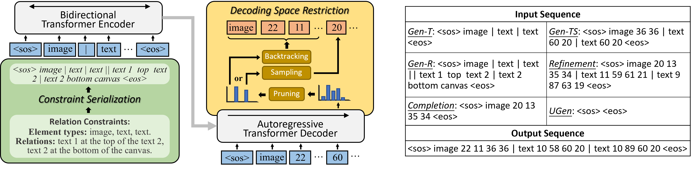

# LayoutFormer++

__[CVPR23] LayoutFormer++: Conditional Graphic Layout Generation via Constraint Serialization and Decoding Space Restriction__

## Introduction
This is the official code for the paper "LayoutFormer++: Conditional Graphic Layout Generation via Constraint Serialization and Decoding Space Restriction", by _Zhaoyun Jiang, Jiaqi Guo, Shizhao Sun, Huayu Deng, Zhongkai Wu, Vuksan Mijovic, Zijiang James Yang, Jian-Guang Lou, Dongmei Zhang_.

Paper: [CVPR](https://openaccess.thecvf.com/content/CVPR2023/papers/Jiang_LayoutFormer_Conditional_Graphic_Layout_Generation_via_Constraint_Serialization_and_Decoding_CVPR_2023_paper.pdf)
Code: [GitHub](https://github.com/microsoft/LayoutGeneration/tree/main/LayoutFormer++)
Video: [YouTube](https://youtu.be/TBdo0XwMoxE)

## Installation
1. Clone this repository

        git clone https://github.com/microsoft/LayoutGeneration.git
        cd LayoutGeneration/LayoutFormer++

2. Create a conda environment 

        conda create -n layoutformer python=3.8
        conda activate layoutformer

3. Install [PyTorch](https://pytorch.org/).

4. Install other dependencies:

        pip install -r requirements.txt

## Dataset
You can

- Download raw datasets by following [const_layout](https://github.com/ktrk115/const_layout/tree/master/data), or 

- Directly use our pre-processed dataset. Please refer to [Inference](##Inference).

## Inference

First, download pre-trained model checkpoints and the pre-processed datasets from [Huggingface](https://huggingface.co/jzy124/LayoutFormer/tree/main).

- download checkpoints:

        git lfs install
        git clone https://huggingface.co/jzy124/LayoutFormer

- move `LayoutFormer/datasets` and `LayoutFormer/ckpts` to `LayoutFormer++/`, as

        LayoutGeneration/LayoutFormer++/
        ├── datasets
        ├── ckpts
        ├── src
        ├── README.md
        ├── ...

Then, run

    cd src
    pip install -e .
    export CUDA_VISIBLE_DEVICES=0

Finally, use the following commands to conduct inference tasks for different layout generation tasks on the two datasets.

|  Dataset      |  Task       | Commands                                                                             |
|  ----         |  ----       | ----                                                                                 |
|   RICO        |  Gen-T      | ./scripts/rico_gen_t.sh test ../datasets ../ckpts/rico_gen_t basic 1 final           |
|   RICO        |  Gen-TS     | ./scripts/rico_gen_ts.sh test ../datasets ../ckpts/rico_gen_ts basic 1 final         |
|   RICO        |  Gen-R      | ./scripts/rico_gen_r.sh test ../datasets ../ckpts/rico_gen_r basic 1 final           |
|   RICO        |  Refinement | ./scripts/rico_refinement.sh test ../datasets ../ckpts/rico_refinement basic 1 final |
|   RICO        |  Completion | ./scripts/rico_completion.sh test ../datasets ../ckpts/rico_completion basic 1 final |
|   RICO        |  UGen       | ./scripts/rico_ugen.sh test ../datasets ../ckpts/rico_ugen basic 1 final             |

|  Dataset      |  Task       | Commands                                                                                        |
|  ----         |  ----       | ----                                                                                            |
|   PubLayNet   |  Gen-T      | ./scripts/publaynet_gen_t.sh test ../datasets ../ckpts/publaynet_gen_t basic 1 final            |
|   PubLayNet   |  Gen-TS     | ./scripts/publaynet_gen_ts.sh test ../datasets ../ckpts/publaynet_gen_ts basic 1 final          |
|   PubLayNet   |  Gen-R      | ./scripts/publaynet_gen_r.sh test ../datasets ../ckpts/publaynet_gen_r basic 1 final            |
|   PubLayNet   |  Refinement | ./scripts/publaynet_refinement.sh test ../datasets ../ckpts/publaynet_refinement/ basic 1 final |
|   PubLayNet   |  Completion | ./scripts/publaynet_completion.sh test ../datasets ../ckpts/publaynet_completion basic 1 final  |
|   PubLayNet   |  UGen       | ./scripts/publaynet_ugen.sh test ../datasets ../ckpts/publaynet_ugen basic 1 final              |

## Training

You can easily train __LayoutFormer++__ with the scripts in `./scr/scripts/`.
Take training for Gen-T on RICO as example, use the command:
    
    cd src
    pip install -e .
    ./scripts/rico_gen_t.sh train ../datasets {OUTPUT_DIR} {TRAINER} {GPU_NUMBER} none

## Citation
If this code helps your research, please cite:

    @InProceedings{Jiang_2023_CVPR,
        author    = {Jiang, Zhaoyun and Guo, Jiaqi and Sun, Shizhao and Deng, Huayu and Wu, Zhongkai and Mijovic, Vuksan and Yang, Zijiang James and Lou, Jian-Guang and Zhang, Dongmei},
        title     = {LayoutFormer++: Conditional Graphic Layout Generation via Constraint Serialization and Decoding Space Restriction},
        booktitle = {Proceedings of the IEEE/CVF Conference on Computer Vision and Pattern Recognition (CVPR)},
        month     = {June},
        year      = {2023},
        pages     = {18403-18412}
    }

## Related Repositories
The data preparation and the evaluation in our code is based on the projects [const_layout](https://github.com/ktrk115/const_layout).