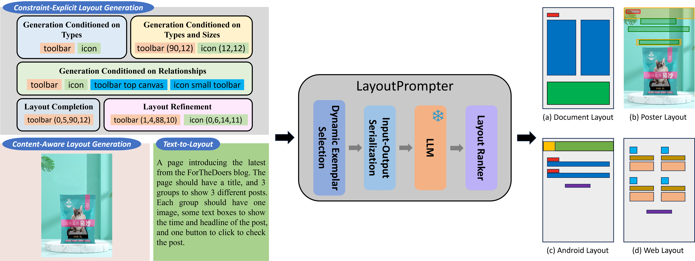
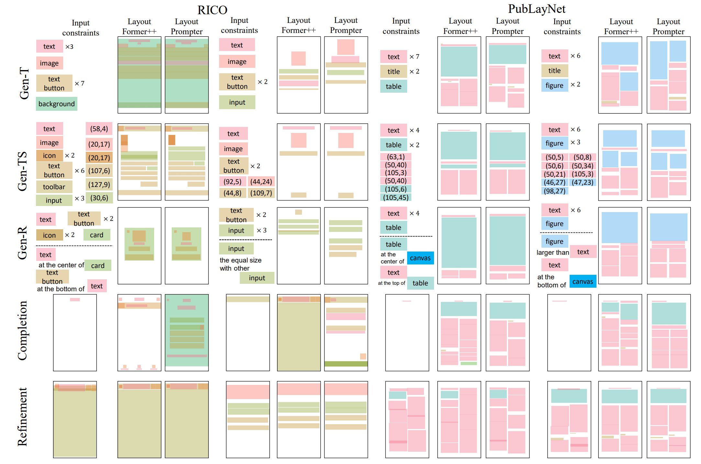
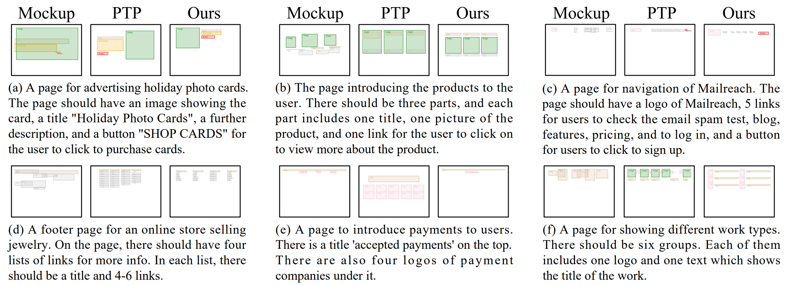

# LayoutPrompter: Awaken the Design Ability of Large Language Models (NeurIPS2023)



[LayoutPrompter](https://arxiv.org/pdf/2311.06495.pdf) is a versatile method for graphic layout generation, capable of solving various conditional layout generation tasks (as illustrated on the left side) across a range of layout domains (as illustrated on the right side) without any model training or fine-tuning.

## Results

We conduct experiments on three groups of layout generation tasks, including
- constraint-explicit layout generation
- content-aware layout generation
- text-to-layout

Below are the qualitative results.

### Constraint-Explicit Layout Generation



### Content-Aware Layout Generation


### Text-to-Layout



## Installation

1. Clone this repository

```
git clone https://github.com/microsoft/LayoutGeneration.git
cd LayoutGeneration/LayoutPrompter
```

2. Create a conda environment

```
conda create -n layoutprompter python=3.8
conda activate layoutprompter
```

3. Install PyTorch and other dependencies

```
conda install pytorch=1.13.1 torchvision torchaudio pytorch-cuda=11.7 -c pytorch -c nvidia
pip install -r requirements.txt
pip install -e src/
```

## Datasets

We use 4 datasets in this work, including `RICO`, `PubLayNet`, `PosterLayout` and `WebUI`.
They can be downloaded from [HuggingFace](https://huggingface.co/datasets/KyleLin/LayoutPrompter) using the following commands:

```
git lfs install
git clone https://huggingface.co/datasets/KyleLin/LayoutPrompter
```

Move the contents to the `dataset` directory as follows:

```
dataset/
├── posterlayout
├── publaynet
├── rico
├── webui
```

## Notebooks

We include three jupyter notebooks [here](./notebooks), each corresponding to a type of layout generation task.
They all consist of the following components:
- Configuration
- Process raw data
- Dynamic exemplar selection
- Input-output serialization
- Call GPT
- Parsing
- Layout ranking
- Visualization

Try it!

## Citation

If you find this code useful for your research, please cite our paper:

```
@inproceedings{lin2023layoutprompter,
  title={LayoutPrompter: Awaken the Design Ability of Large Language Models},
  author={Lin, Jiawei and Guo, Jiaqi and Sun, Shizhao and Yang, Zijiang James and Lou, Jian-Guang and Zhang, Dongmei},
  booktitle={Thirty-seventh Conference on Neural Information Processing Systems},
  year={2023}
}
```
