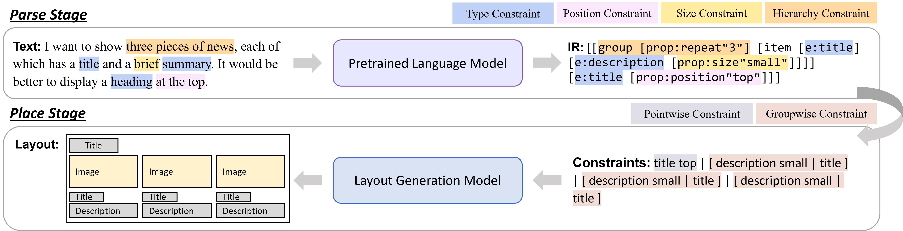

# A Parse-Then-Place Approach for Generating Graphic Layouts from Textual Descriptions (ICCV2023)

This repository is an official implementation of Parse-Then-Place, the first text2layout approach.
Please refer to the [paper](https://arxiv.org/abs/2308.12700) for more details.



## Installation

1. Clone this repository
```bash
git clone https://github.com/microsoft/LayoutGeneration.git
cd LayoutGeneration/Parse-Then-Place
```
2. Create a conda environment
```bash
conda create -n ptp python=3.8
conda activate ptp
```
3. Install PyTorch and other dependencies
```bash
conda install pytorch=1.13.1 torchvision torchaudio pytorch-cuda=11.7 -c pytorch -c nvidia
pip install -r requirements.txt
pip install -e src/
```

## Downloading datasets and checkpoints

The model checkpoints and our constructed two text2layout datasets (i.e., WebUI and RICO) are provided in [HuggingFace](https://huggingface.co/datasets/KyleLin/Parse-Then-Place).
Use the following commands to download them:
```bash
git lfs install
git clone https://huggingface.co/datasets/KyleLin/Parse-Then-Place
```
You now have a directory structure as follows:
```bash
src/
Parse-Then-Place/
├── ckpt/
    ├── rico/
        ├── stage1/
        ├── stage2/
            ├── pretrain/
            ├── finetune/
    ├── web/
    ...
├── data/
...
```
`stage1` and `stage2` represent the parse stage and place stage, respectively.
Since in the place stage, the approach first pre-trains on unlabeled layouts and then fine-tunes on labeled datasets, thus, there are two subdirectories `pretrain` and `finetune` in the `stage2` directory, containing the respective checkpoints and datasets.

## Inference

### Stage1 (parse stage)

Once you download the checkpoints and datasets, and make sure they are in `./Parse-Then-Place/ckpt` and `./Parse-Then-Place/data` respectively, you can simply run the following commands to generate the intermediate representation (IR) from textual descriptions:
```bash
cd src
dataset=rico
CUDA_VISIBLE_DEVICES=0 bash ./semantic_parser/scripts/eval/adapter_eval.sh \
../Parse-Then-Place/data/$dataset/stage2/finetune \
../Parse-Then-Place/ckpt/$dataset/stage1 \
../tmp/output/$dataset/stage1 \
test \
google/t5-v1_1-base \
$dataset
```
Set `dataset=web` to test on WebUI dataset.

### Stage2 (place stage)

Make sure you have run [Stage1](#Stage1-(parse-stage)) and generated a file named `test_predictions.json`, so you can proceed to Stage2.
At this stage, the layouts are generated according to the layout constraints in IR.
```bash
dataset=rico
mode=pretrain
CUDA_VISIBLE_DEVICES=0 bash ./layout_placement/scripts/two_stage_test.sh \
../Parse-Then-Place/ckpt/$dataset/stage2/$mode \
../Parse-Then-Place/data/$dataset/stage2/finetune \
../tmp/output/$dataset/stage2/$mode \
$dataset \
../tmp/output/$dataset/stage1/test_predictions.json
```
Similarly, set `dataset=web` to test on WebUI.
`mode` can be `pretrain` or `finetune`.

## Training

You can also train Parse-Then-Place from scratch.

### Stage1

```bash
dataset=rico
CUDA_VISIBLE_DEVICES=0,1,2,3 bash ./semantic_parser/scripts/train/adapter_train.sh \
../Parse-Then-Place/data/$dataset/stage1 \
../tmp/ckpt/$dataset/stage1 \
val \
google/t5-v1_1-base \
${dataset}_stage1 \
$dataset
```

### Stage2

First pretrain on unlabeled layouts (the layout constraints are extracted by rules):
```bash
dataset=rico
CUDA_VISIBLE_DEVICES=0,1,2,3 bash ./layout_placement/scripts/two_stage_pretrain.sh \
../Parse-Then-Place/data/$dataset/stage2/pretrain \
../tmp/ckpt/$dataset/stage2/pretrain \
4 \
1500000 \
${dataset}_stage2_pretrain
```

Then, finetune on labeled datasets (WebUI and RICO), where the layout constraints are labeled by human annotators.
```bash
dataset=rico
CUDA_VISIBLE_DEVICES=0,1,2,3 bash ./layout_placement/scripts/two_stage_finetune.sh \
../Parse-Then-Place/data/$dataset/stage2/finetune \
../tmp/ckpt/$dataset/stage2/finetune \
/path/to/pretrain/ckpt \
4 \
true \
${dataset}_stage2_finetune
```
Please replace `/path/to/pretrain/ckpt` as the pretrained checkpoint (e.g., `../Parse-Then-Place/ckpt/rico/stage2/pretrain`).

In addition, we also provide the command to train a one-stage text2layout model with labeled <text, layout> pairs:
```bash
dataset=rico
CUDA_VISIBLE_DEVICES=0,1,2,3 bash ./layout_placement/scripts/one_stage_train.sh \
../Parse-Then-Place/data/$dataset/stage2/finetune \
../tmp/ckpt/$dataset/end2end \
4 \
true \
${dataset}_end2end
```

## Visualization

To display the generated layouts, simply run the following command:
```bash
python ./utils/visualization.py \
--dataset rico \
--prediction_filename /path/to/stage2/prediction/file \
```
Set `--is_draw_ground_true` to display real layouts rather than predicted layouts.

## citation

If you find this code useful for your research, please cite our paper:

```
@InProceedings{lin2023parse,
  title={A Parse-Then-Place Approach for Generating Graphic Layouts from Textual Descriptions},
  author={Lin, Jiawei and Guo, Jiaqi and Sun, Shizhao and Xu, Weijiang and Liu, Ting and Lou, Jian-Guang and Zhang, Dongmei},
  booktitle = {Proceedings of the IEEE/CVF International Conference on Computer Vision (ICCV)},
  year={2023}
}
```